<div align="center">

<h3><code>team@github ~ $ ./contributions.sh</code></h3>


<br><br>

<h3><code>team@github ~ $ whoami</code></h3>
<table>
  <tr>
    <td valign="top"></td>
    <td valign="top"></td>
  </tr>
</table>

<br>

<code>Software Engineer AI Intern @ Omise · Full-Stack Developer · ICT @ Mahidol University</code>

</div>

<br>

<div align="center">
<h3><code>team@github ~ $ cat experience.md</code></h3>
</div>

- **Software Engineer AI Intern** — *Omise (Opn Payments)* · `Apr 2026 – Present`
  - Built a Python-based Risk Score Engine for an automated underwriting system; designed KYC-focused AI solutions; presented PoCs in Next.js, Golang, and JavaScript.
- **Backend Developer Intern / Part-time** — *Tech Horizon (Japan Fintech)* · `Jan 2026 – Mar 2026`
  - Engineered a Japanese e-wallet with BNPL in PHP; integrated major Japanese payment gateways.
- **Lab Assistant** — *Biomedical Informatics Research Lab* · `Aug 2024 – Present`
  - Built end-to-end AI pipelines (TensorFlow, PyTorch) for Full HD 240fps video research.
- **Software Engineering Intern** — *CourseSquare* · `2024`
  - Maintained and enhanced the educational platform's web applications.

<br>

<div align="center">
<h3><code>team@github ~ $ cat projects.md</code></h3>
</div>

| Project | Description | Stack |
| :--- | :--- | :--- |
| **[BONDUP](https://play.google.com/store/apps/details?id=com.bondupmvs.com)** | Real-time community & activity app (Lead Mobile Developer). | Flutter, Clean Architecture |
| **BlinkDx** | AI blink anomaly detection (95% accuracy) — Honorable Mention, NSC 2025. | Python, PyTorch, Computer Vision |
| **AI Restricted Area Protection** | Bird-detection surveillance system — 1st Prize, AI Hackathon 2024. | Python, Computer Vision |
| **MUICT Open House** | Mobile-first registration for 200+ concurrent participants. | Next.js, Express.js, MongoDB |

<br>

<div align="center">
<h3><code>team@github ~ $ cat skills.txt</code></h3>
</div>

```text
Languages : Python, C/C++, Golang, JavaScript, TypeScript, Dart, PHP, SQL
Frontend  : Flutter, Next.js, React, HTML/CSS, Tailwind CSS
Backend   : Node.js, Express.js, PostgreSQL, MongoDB, Redis, Firebase, RESTful APIs
AI/ML     : TensorFlow, PyTorch, Scikit-Learn, Pandas, NumPy, Computer Vision
DevOps    : Git, Docker, Linux, CI/CD, Agile/Scrum, UML
```

<br>

<div align="center">
<h3><code>team@github ~ $ ./contact.sh</code></h3>
</div>

- **Portfolio** → [profile.teampk.site](https://www.profile.teampk.site)
- **LinkedIn** → [Pannawit Krutnak](https://www.linkedin.com/in/pannawit-krutnak-9728562a8/)
- **Email** → [amteamxmail@gmail.com](mailto:amteamxmail@gmail.com)
- **GitHub** → [AmTeamX](https://github.com/AmTeamX)
