<h3><code>team@github ~ $ ./contributions.sh</code></h3>

  

<h3><code>team@github ~ $ whoami</code></h3>
<table>
  <tr>
    <td valign="top"></td>
    <td valign="top"></td>
  </tr>
</table>

 

<code>Software Engineer AI Intern @ Omise · Full-Stack Developer · ICT @ Mahidol University</code>

 

 

<h3><code>team@github ~ $ ./links.sh</code></h3>

[BONDUP](https://play.google.com/store/apps/details?id=com.bondupmvs.com) · [Portfolio](https://www.profile.teampk.site) · [LinkedIn](https://www.linkedin.com/in/pannawit-krutnak-9728562a8/) · [Email](mailto:amteamxmail@gmail.com) · [GitHub](https://github.com/AmTeamX)

